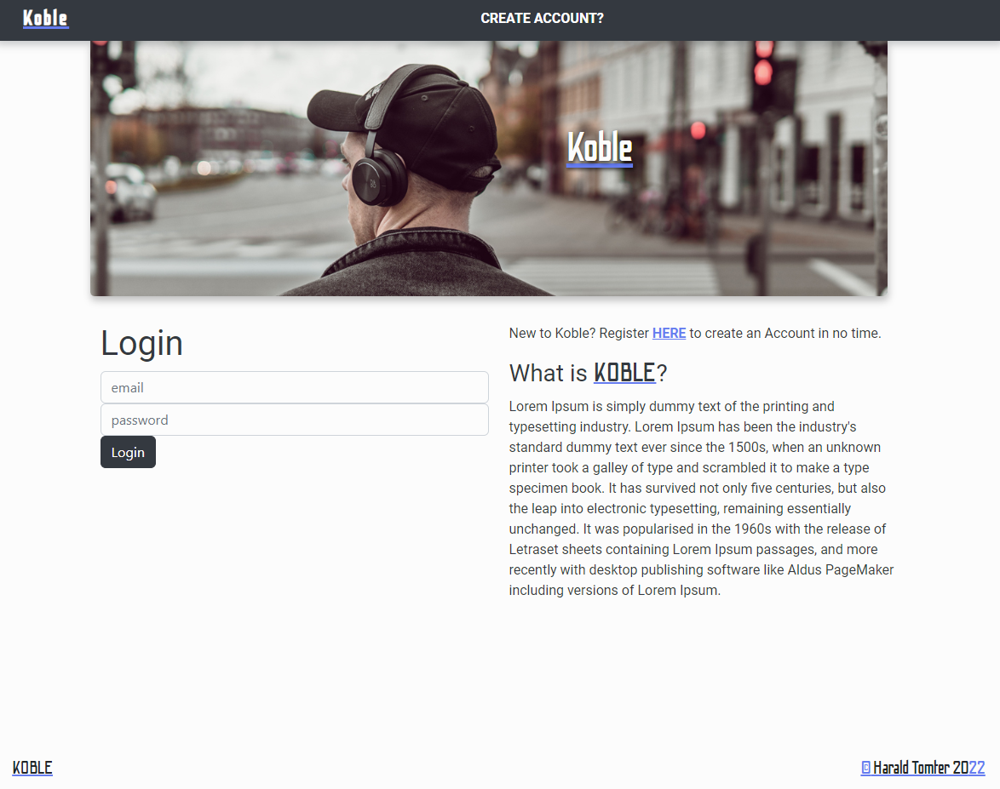
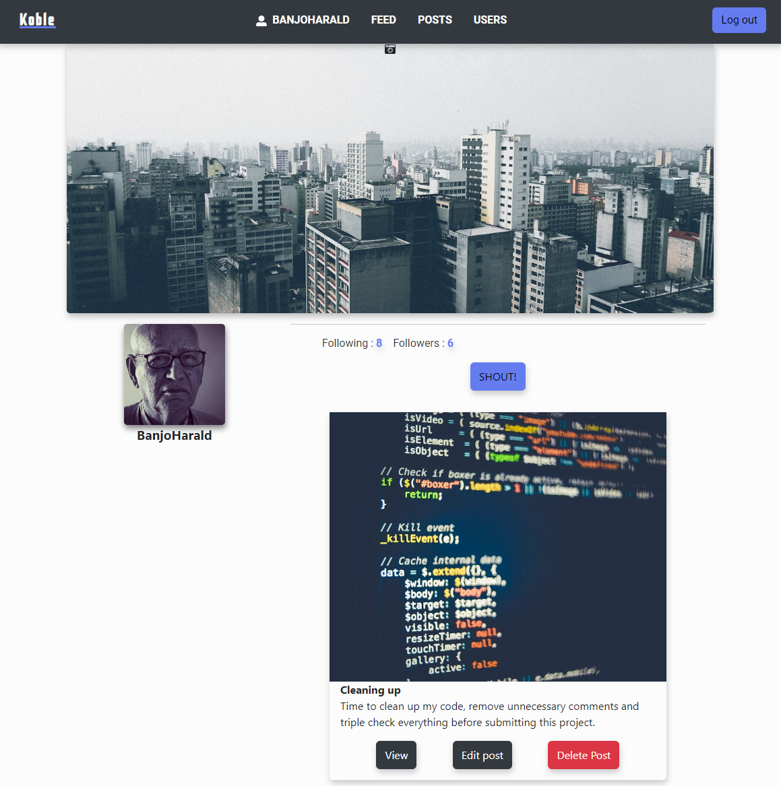
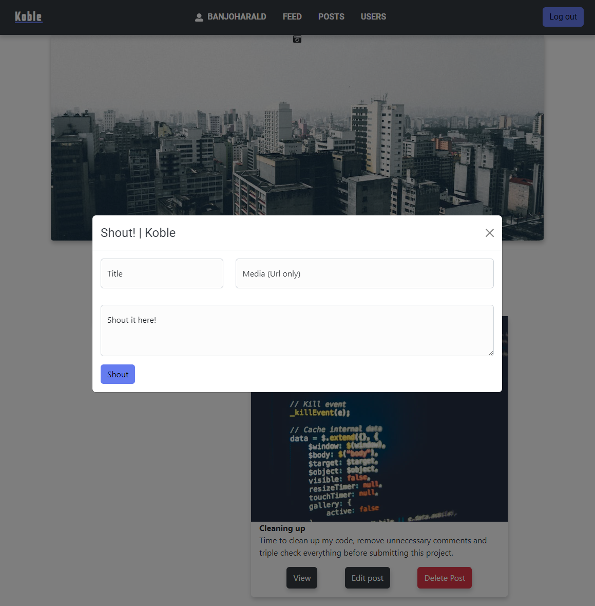

# Project Exam 2 | Noroff




### Login credentials

Feel free to log in with this "testuser":
(or you can create a new)

Login: banjo@noroff.no
password: banjo123

## Description

An existing Social Media company has approached you to create a brand new front end for their application. While they have a list of required features, the design and user experience has not been specified. Working with the official API documentation, plan, design and build a modern front end social media application.


### Steps

- Create a 7 week plan with the use of Gantt and a Kabnan Board
- Create a Style Guide and a design prototype for the project
- Develop the project and deliver within the deadline.

### Technical requirements

- JavaScript Framework
- CSS Framework
- Hosted on a static Host
- Designed in Adobe XD or Figma
- Planned in a "approved" Planning Application

## Project Requirements

The client has specified the following requirements in the form of *User Stories*:
1. A user with a `stud.noroff.no` email may register
2. A registered user may login
3. A registered user may update their avatar and banner
4. A registered user may logout
5. A registered user may view a list of `Posts`
6. A registered user may view a list of `Profiles`
7. A registered user may view a single `Post` by `id`
8. A registered user may view a single `Profile` by `name`
9. A registered user may create a `Post`
10. A registered user may update a `Post` they own
11. A registered user may delete a `Post` they own
12. A registered user may create a `Comment` on any `Post`
13. A registered user may `react` to any `Post` with an emoji
14. A registered user may `follow` and `unfollow` another `Profile`

### API

The API I am using for this project can be found under Social EndPoints in the Noroff API documentation. [https://noroff-api-docs.netlify.app/]


## Built With


- [React.js](https://reactjs.org/)
- [Bootstrap](https://react-bootstrap.github.io/)
- [Sass](https://sass-lang.com)
- [React-Hook-Form](https://react-hook-form.com)
- [React-Icons](https://react-icons.github.io/react-icons)
- [Postman](https://learning.postman.com/docs/getting-started/introduction/)
- [Moment](https://momentjs.com/)
- [HTML]
- [JavaScript]

## Getting Started

### Installing


1. Clone the repo:

```bash
git clone git@github.com:Noroff-FEU-Assignments/project-exam-2-Harald-86/
```

2. Install the dependencies:

```
npm install
```


### Warning

Before running this project please make sure your localStorage does not have any "auth" key stored.

### Running

To run the app, run the following commands:

```bash
npm run start
```

## Contributing

Contributing is not possible for this project since it is an School project.

## Contact

You can send me an email or visit my LinkedIn profile listet:

- Email : hm.tomter@gmail.com
- [My LinkedIn page](https://www.linkedin.com/in/harald-morten-tomter-6b7148204/)


## Project Reflection

Koble is a social platform created on Noroff`s social API where you can create an userprofile, create your own post, read other users posts, comment and react with emojis, see other profiles, get followers and follow otherusers. You can even customize your profile with a banner and a profile picture.

The planning for the project went well, i`ve learned over the years at Noroff how to work independent and structured with the help of Trello and a Gantt chart. I`ve had some struggles/Challenges on the way with some functions way longer than i should and ended up asking for some hints/tips and trick from one of the tutors in my class. I got the help i needed to move on and learned tons of stuff from the struggle i had and the help i got from Noroff.

If i am to go deeper into the one big main issue i had that took almost all the time in my coding weeks was the usage of useEffect and state handling to update the states in realtime and make my components rerender on submit, onclick, between/cross parent and child components.
In one point i`ve read up on useReducer hook and tried to implement it but as a "newbie" to React and the way i created my components it felt like to much work to implement the useReducer hook.

The soloution was this easy: i passed functions down to the children as props and called the parent functions inside the children. And WOOPSi. there my components rerendred and displayed new posts in realtime as i created new entries, updated my avatar and so on. Perfect.

One tool i want to mention that used alot in this project was Postman, i`ve created all the POST,GET,PUT,DELETE requests that this project needed in Postman before creating the JSX. As always i enjoy using new tools and learning them and i believe im gonna deep dive into Postman abit more to learn more about it.

Other than that, i really enjoyed this project, and it made me want to create more projects in React. Every semester project and exam has tested my skills and i learned more from these project than anything else.
I have a long list of things i want to implement in my PE2 but never had the time, but the project i delivered is a project that i am proud of and i hope you enjoy testing it aswell.

Best regards Koble Creator Harald Tomter.




